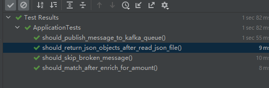

### Kafka env setup and test
### Write test code for JSON file reader
### Implement jSON file reader
### Write test code for trade message validation
### Implement code for message validation
### Write test code for message enrichment
### Implement code for message enrichment
### Write test code for message publish
### Implement code for message publish

